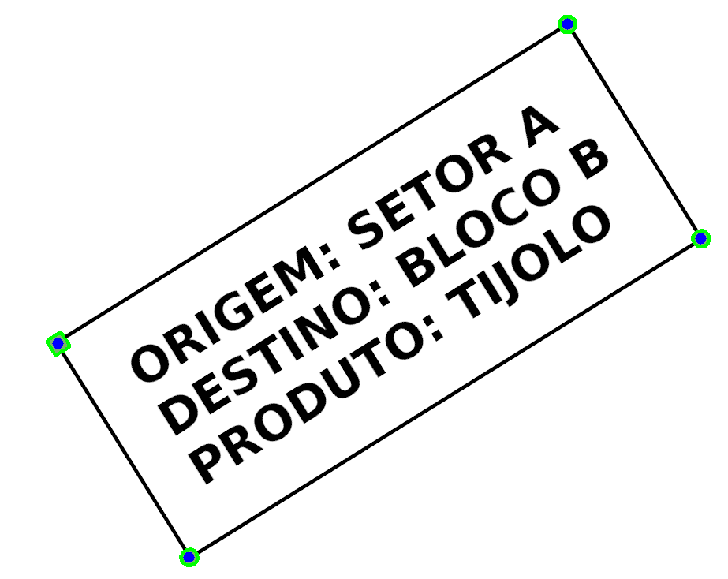
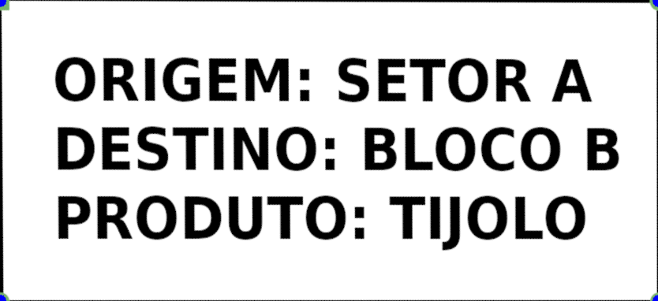
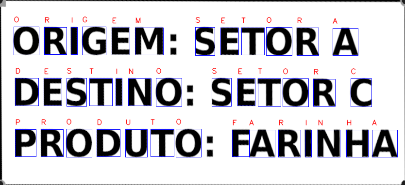
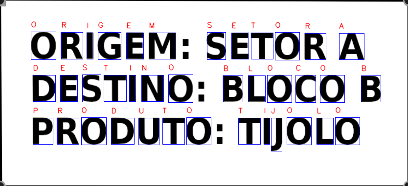

# 🏷️ Leitor de Etiquetas Industriais (OCR) com Correção de Perspectiva

## Sobre o Projeto
Este Projeto teve como objetivo desenvolver um sistema de Reconhecimento Óptico de Caracteres (OCR) utilizando Python e OpenCV. O programa foi projetado para ler imagens de etiquetas, corrigir distorções severas de perspectiva e realizar a extração do texto impresso. 

A solução foi inteiramente construída utilizando técnicas clássicas de Visão Computacional, especificamente *Template Matching* baseado em um alfabeto pré-definido, sem o uso de redes neurais ou bibliotecas de OCR prontas (como o Tesseract).

---

## ⚙️ Metodologia e Pipeline de Processamento

### 1. Correção de Perspectiva
O alinhamento da imagem é garantido através de marcadores visuais (pontos verdes) nos cantos das etiquetas:
* **Filtragem de Cor:** Aplicação de uma máscara para isolar as áreas verdes da imagem original, utilizando o valor de referência BGR (106, 180, 120).
* **Detecção de Bordas:** Utilização do algoritmo de Canny sobre a imagem binária gerada.
* **Operações Morfológicas:** Aplicação de uma dilatação (1 iteração) para fechar bordas e evitar detecções inválidas pelo `cv2.findContours`.
* **Mapeamento de Vértices:** Cálculo do centroide de cada contorno. A partir da identificação do canto superior esquerdo (forma quadrada), calcula-se a distância espacial para classificar automaticamente os demais vértices: canto inferior esquerdo (menor distância), canto superior direito (segunda menor) e canto inferior direito (maior distância).
* **Transformação Geométrica:** Aplicação da matriz de transformação de perspectiva para gerar uma imagem plana padronizada com dimensões de 834x382 pixels.

  
  

### 2. Reconhecimento Óptico de Caracteres (Template Matching)
Com a etiqueta retificada, o texto é segmentado e traduzido:
* **Construção do Dicionário:** O programa carrega uma imagem base contendo o alfabeto, aplica binarização e extrai os contornos de cada letra, formando um dicionário de *templates*.
* **Extração de Linhas:** Na imagem de entrada, os contornos são agrupados em linhas usando um limiar vertical de 100 pixels, mantendo o texto estruturado.
* **Classificação:** As bounding boxes da etiqueta são redimensionadas para o mesmo tamanho dos templates do dicionário e comparadas iterativamente.
* **Validação:** Um caractere é validado e impresso na saída final apenas se a correlação (*Match Template*) for superior ao limiar de 0.8.

---

## 🛠️ Solução de Edge Cases
Durante o desenvolvimento, identificou-se que a letra "I" no alfabeto base consistia apenas em um retângulo simples, gerando uma alta taxa de falsos positivos na função `cv2.MatchTemplate`. 

**Solução implementada:** O dicionário de templates foi reorganizado, movendo a letra "I" para o final da fila de verificação. Com essa heurística simples, letras com características mais complexas são validadas primeiro, eliminando o problema de falsos positivos sem custo computacional extra.

---

## 📊 Resultados Obtidos
O algoritmo foi avaliado em um conjunto de testes contendo diversas etiquetas com fortes inclinações e distorções geométricas.

* **Acurácia:** O sistema alcançou **100% de taxa de acerto** em todo o conjunto de testes.
* **Robustez:** Capaz de identificar os quatro vértices, retificar o plano da imagem com precisão e extrair o texto corretamente em todas as amostras.

### Demonstração do OCR

  

  

